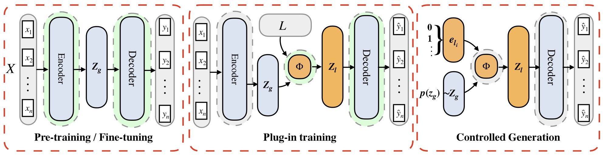
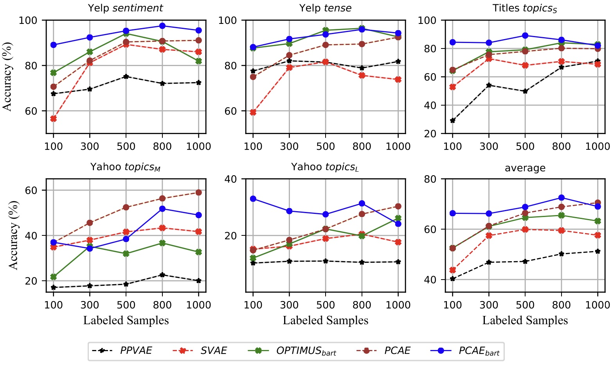

# PCAE: A Framework of Plug-in Conditional Auto-Encoder for Controllable Text Generation

Official PyTorch implementation of *[PCAE: A Framework of Plug-in Conditional Auto-Encoder for Controllable Text Generation](https://www.sciencedirect.com/science/article/pii/S0950705122008942)*, published in *Knowledge-Based Systems*. We provide PCAE as well as all implemented baselines (PPVAE and Optimus) under pre-trained BART.




## News

- [2022-03-02] We are sharing fine-tuned BART VAE [here](https://drive.google.com/file/d/1hp_vm1rQIxWgCSkgm7cKtasGWxCG1kL8/view?usp=sharing) now!
- [2022-10-10] Our paper is available on [arXiv](https://arxiv.org/abs/2210.03496) now.
- [2022-09-27] Our paper is now in this [paper list](https://github.com/ImKeTT/CTG-latentAEs), which aims at collecting all kinds of latent variational auto-encoders that controllably generate texts. Feel free to check it out and contribute!
- [2022-09-27] We release our PCAE and baseline codes under the setup of pre-trained BART.
- [2022-09-06] Our work PCAE is [available](https://www.sciencedirect.com/science/article/pii/S0950705122008942) online.
- [2022-08-21] Our paper PCAE is accepted to *Knowledge-Based Systems*.

## Setup

Make sure you have installed

```bash
transformers
tqdm
torch
numpy
```

## Dataset

We conduct five tasks span from three datasets: *Yelp review*, *Titles* and *Yahoo Question*. 

We provide our full processed datasets in:

-  [BaiduPan](https://pan.baidu.com/s/11vEqD_liL_U8brCEC6Nohg?pwd=bx81) (password `bx81`) 
- [GoogleDrive](https://drive.google.com/file/d/1XDHN3rbXhl-dc_cqIFsQCd01pr6BiQjn/view?usp=sharing)

Please download `data.zip` and unzip it to the current folder.

You can also try your own data, follow the split in `data` folder. Note that, for PPVAE, you have to manually split negative samples for every control signal.

## Training

### Stage 1 BART VAE Finetuning

You can download full `./checkpoints` folder from [here](https://drive.google.com/file/d/1hp_vm1rQIxWgCSkgm7cKtasGWxCG1kL8/view?usp=sharing), unzip it to the current folder.

Or you can train the BART VAE from the scratch: 

Finetuning on three datasets. (choose DATA from `yelp`, `yahoo`, `titles`, and EPOCH from 8, 10, 10):

```shell
DATA=yelp
EPOCH=8
python train.py --run_mode vae_ft --dataset $DATA --zmanner hidden\
--gpu 0 1 --dim_z 128 --per_gpu_train_batch_size 64\
--train_epochs $EPOCH --fb_mode 1 --lr 5e-4 --first_token_pooling --eval_every 500
```




### Stage 2.1 PCAE Plug-in Training

Plug-in training of PCAE. Choose arguments below:

+ TASK: [sentiment,  tense,  topics, quess_s, quess] 

  (topics, quess_s, quess corresponds to $topics_S,topics_M, topics_L$ in the paper respectively)

+ SAMPLE_N: [100, 300, 500, 800, 1000]

+ NUM_LAYER: int number from 8 to 15 is fine

+ EPOCH: 10 to 20 is fine, less SAMPLE_N means less EPOCH required

```shell
TASK=sentiment
EPOCH=10
SAMPLE_N=100
NUM_LAYER=10

python train.py --run_mode pcae --task $TASK --zmanner hidden\
--gpu 0 --dim_z 128 --per_gpu_train_batch_size 5\
--plugin_train_epochs $EPOCH --fb_mode 1 --sample_n $SAMPLE_N\
--layer_num $NUM_LAYER --lr 1e-4 --use_mean
```

### Stage 2.2 PPVAE Plug-in Training

Plug-in training of PPVAE BART. Choose arguments below:

+ TASK: [sentiment,  tense,  topics, quess_s, quess]
+ SAMPLE_N: [100, 300, 500, 800, 1000]
+ TASK_LABEL: [pos, neg] for sentiment task; [present, past] for tense task; [0, 1, 2, 3, 4] for topics task; [0, 1, 2, 3, ..., 9] for quess task
+ EPOCH: 10 to 20 is fine, less SAMPLE_N means less EPOCH required

For example, if you want to train PPVAE to generate **positive** sentences in sentiment task with 100 training samples per class, run:

```shell
TASK=sentiment
EPOCH=10
SAMPLE_N=100
TASK_LABEL=pos

python train.py --run_mode ppvae --task $TASK --zmanner hidden\
--gpu 0 --dim_z 128 --per_gpu_train_batch_size 5\
--plugin_train_epochs $EPOCH --fb_mode 1 --sample_n $SAMPLE_N\
--task_label $TASK_LABEL --lr 1e-4 --ppvae_dim_bottle 25
```

### Stage 2.3 Optimus_{bart} Plug-in Finetuning

Plug-in finetuning of Optimus under BART setup. Choose arguments below:

+ TASK: [sentiment,  tense,  topics, quess_s, quess] 
+ SAMPLE_N: [100, 300, 500, 800, 1000]
+ EPOCH: 10 to 20 is fine, less SAMPLE_N means less EPOCH required

```shell
TASK=sentiment
EPOCH=10
SAMPLE_N=100

python train.py --run_mode optimus --task $TASK --zmanner hidden\
--gpu 0 --dim_z 128 --per_gpu_train_batch_size 5\
--plugin_train_epochs $EPOCH --fb_mode 1 --sample_n $SAMPLE_N\
--lr 1e-4
```

## Others

Please [email](tuisaac163@gmail.com) me or open an issue if you have further questions.

if you find our work useful, please cite the paper and star the repo~ :)

```bibtex
@article{tu2022pcae,
  title={PCAE: A framework of plug-in conditional auto-encoder for controllable text generation},
  author={Tu, Haoqin and Yang, Zhongliang and Yang, Jinshuai and Zhang, Siyu and Huang, Yongfeng},
  journal={Knowledge-Based Systems},
  volume={256},
  pages={109766},
  year={2022},
  publisher={Elsevier}
}
```

We thank open sourced codes related to VAEs and plug-and-play models, which inspired our work!!